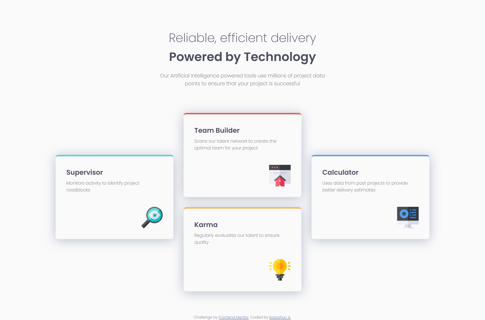

# Frontend Mentor - Four card feature section solution

This is a solution to the [Four card feature section challenge on Frontend Mentor](https://www.frontendmentor.io/challenges/four-card-feature-section-weK1eFYK). Frontend Mentor challenges help you improve your coding skills by building realistic projects. 

## Table of contents

- [Overview](#overview)
  - [The challenge](#the-challenge)
  - [Screenshot](#screenshot)
  - [Links](#links)
- [My process](#my-process)
  - [Built with](#built-with)
  - [What I learned](#what-i-learned)
  - [Useful resources](#useful-resources)
- [Author](#author)
- [Acknowledgments](#acknowledgments)

**Note: Delete this note and update the table of contents based on what sections you keep.**

## Overview

### The challenge

Users should be able to:

- View the optimal layout for the site depending on their device's screen size

### Screenshot

### Links

- Solution URL: [https://github.com/kassahunAmdie/Four-card-feature-section-master](https://your-solution-url.com)
- Live Site URL: [https://kassahunamdie.github.io/Four-card-feature-section-master/](https://your-live-site-url.com)

## My process

### Built with

- Semantic HTML5 markup
- CSS custom properties
- Flexbox
- CSS Grid
- Mobile-first workflow

### What I learned

In this challenge I learned fluid typography in greater detail and using that same prinicple changing padding and width of elements to make them reponsive. This helped in writing less media query and making the responsivness more fluid.

### Useful resources

- [Designing Beautiful Shadows in CSS](https://www.joshwcomeau.com/css/designing-shadows/) - I was very impressed by how much there is to shadows. I learned a lot from Josh Comeau's blog how to approach this tool. I still need to learn and practice more, but this was a good start. My previous experience with shadows was just pluging in numbers and not give it much thought. That didn't help with matching the design of this challenge which led to the discovery of this blog on shadows.
- [Mark Bacon's clamp function calculator](https://www.marcbacon.com/tools/clamp-calculator/) - My understanding of the clamp function was greatly increased by this challenge. I made extensive use of this function in this challenge. But finding the right middle value was a lot of work at first. Then I found this resource by Mark Bacon that simplified the process.

## Author

- Frontend Mentor - [@kassahunAmdie](https://www.frontendmentor.io/profile/yourusername)

